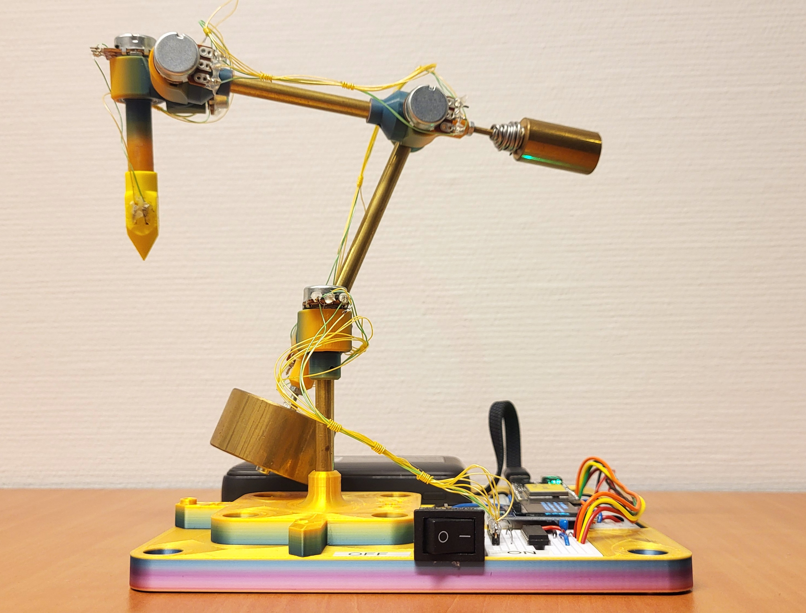
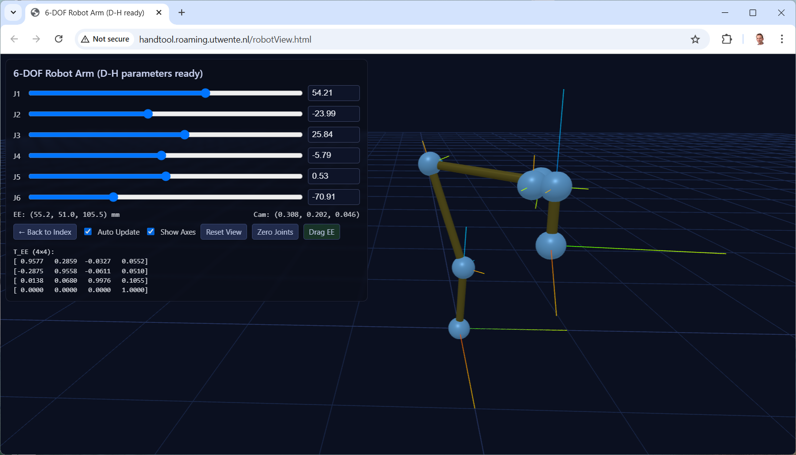

# HandTool
Handheld 6 DOF input device for robot control applications.

# Introduction

HandTool is a 6 DOF input device intended for manipulating robot arms and other applications involving manipulation of rigid bodies. It is low-cost and fully open source.

The tool has six potentiometers connected together with 3D printed parts and brass shafts. The tool is balanced by two masses so that it mostly stays in position when released. It also has a pushbutton in the tip, intended to enable/disable dragging of some controlled object.

The tool is WiFi enabled; the microcontroller serves webpages and provides several HTTP endpoints providing data in JSON format. The idea is that it could dynamically connect to other WiFi-enabled robot arms.

# Electronics

The microcontroller is an ESP32-C5-DevKitC-1. It is chosen for its 5 GHz WiFi capabilities, which is essential inside university buildings due to congestion in the 2.4 GHz band. A MCP3008 A/D unit measures the potentiometer values while a 1.3" OLED displays some status information.

# User interface

THe main user interface is accessed in a web browser at the device's address. The device connects to university's iotroam network, registered at iotroam.nl. A hostname can be coupled to its MAC address to give it a static hostname, such as handtool.roaming.utwente.nl . The IP address is also displayed on the screen, which is useful as it is dynamic and a change in IP address takes a few minutes to propagate through the DNS servers.

## 3D robot view

This screenshot shows a schematic rendering of the HandTool. If it is not connected, the sliders can be used to manipulate it.

## HTTP endpoints

The following HTTP endpoints are available:

- / Main page.
- /index.html Main page, same as /
- /robotView.html Open Robot View (3D)
- /allData JSON structure with all available data
- /angles JSON structure with joint angles in degrees
- /rawAdcValues JSON structure with raw ADC values
- /fk JSON structure with end-effector to robot coordinate transformation matrix
- /serialAngles Enable/disable outputting angles to serial port
- /serialFK Enable/disable outputting end-effector coordinate frame to serial port
- /serialFrequency Control frequency of serial data

## Bill of Materials

1. 6x potmeter: WH148 compatible, 10KΩ. I used R16148-1A-2-B10K.
2. 6x ball bearing: 6700ZZ or equivalent. 15x10x4 mm.
3. Brass tubes, outer diameter 7 mm, wall thickness 0.5 mm. Lengths: 54 mm, 76 mm, 90 mm.
4. M3 threaded rod for small counterweight, 50 mm.
5. M3 screw (cheese head) for large counterweight, 44 mm. (Use 50 mm, cut to length).
6. Several M3 nuts.
7. M2 screw, 16 mm (to properly fix brass rods in joints).
8. M6 screws for mounting the base (flat head).

## Assembly instructions

3D print parts. Solidworks, STEP and 3MF files are available [here](CAD/v1_2024). Note that the JointHousing Solidworks file has six distinct configurations, with a total of nine printed parts. The pictured version was printed in rainbow PLA filament, starting with purple/blue on the buildplate and extending towards yellow. No supports are needed, but a brim is generally required.

7 mm brass rods (wall thickness 0.5 mm) are mostly press fitted in 3d printed parts. If the press fit becomes too loose then you can drill a small (1.8 or 1.9 mm) hole so you can tighten it with a M2 screw.

Small and large counterweights are custom made of brass in a workshop using a lathe. Use M3 threaded rods and/or screws and nuts to rigidly attach these to the correct joint. First balance the top part with the small counterweight by adjusting the separation distance. Then balance the whole hand tool with the large counterweight.

Electric wires should be thin and flexible. Solder these to the potentiometer leads and apply hot glue as stress relief, or else the wires may break off at the solder joints.

## History

The HandTool was first developed in 2024 to actuate a robot arm with identical kinematic configuration (apart from a scaling factor), so that direct joint control was possible and no forward/inverse kinematics was needed. See video [here](https://utwente.yuja.com/v/MamriRobot). The HandTool went through four iterations before arriving at v1.0. Earlier versions were not counter-weighted, but used friction in the joints to keep the given pose.

## Roadmap

Upcoming features

- Button on stick to allow start/stop dragging for robot control
- Dedicated PCB for electronics
- Calibrate zero position in software, saving offsets in filesystem
- Additional communication protocols
  - Examples: Bluetooth, MQTT, ROS2, Serial, ...
  - Want to implement it yourself? Clone the repository, implement it and make a pull request!
 

## Phyiscal devices

First HandTool at RaM [handtool.roaming.utwente.nl](http://handtool.roaming.utwente.nl/) (accessible from within University of Twente's network)

Status of Vincent's physical devices: see [this page](https://vincentgroenhuis.nl/devices/device_display.php).
