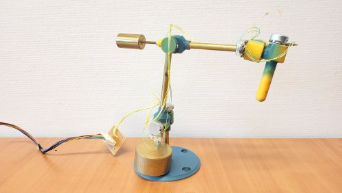

# HandTool
Handheld 6 DOF input device for robot control applications.

[Large size photo](pics/HandTool_Main.jpg?raw=true)

## System diagram

## Bill of Materials

1. 6x potmeter: type R16148-1A-2-B10K or equivalent. 10K, linear.
2. 6x ball bearing: 6700ZZ or equivalent. 15x10x4 mm.
3. Brass tubes, outer diameter 7 mm, wall thickness 0.5 mm. Lengths: 54 mm, 76 mm, 90 mm.
4. M3 threaded rod for small counterweight, 50 mm.
5. M3 screw (cheese head) for large counterweight, 44 mm. (Use 50 mm, cut to length).
6. Several M3 nuts
7. M2 screw, 16 mm (to properly fix brass rods in joints)
8. M6 screws for mounting the base (flat head)

## Assembly instructions

3D print parts. Solidworks, STEP and 3MF files are available [here](CAD/v1_2024). Note that the JointHousing Solidworks file has six distinct configurations, with a total of nine printed parts. The pictured version was printed in rainbow PLA filament, starting with purple/blue on the buildplate and extending towards yellow. No supports are needed, but a brim is generally required.

7 mm brass rods (wall thickness 0.5 mm) are mostly press fitted in 3d printed parts. If the press fit becomes too loose then you can drill a small (1.8 or 1.9 mm) hole so you can tighten it with a M2 screw.

Small and large counterweights are custom made of brass in a workshop using a lathe. Use M3 threaded rods and/or screws and nuts to rigidly attach these to the correct joint. First balance the top part with the small counterweight by adjusting the separation distance. Then balance the whole hand tool with the large counterweight.

Electric wires should be thin and flexible. Solder these to the potentiometer leads and apply hot glue as stress relief, or else the wires may break off at the solder joints.

## History

The HandTool was first developed in 2024 to actuate a robot arm with identical kinematic configuration (apart from a scaling factor), so that direct joint control was possible and no forward/inverse kinematics was needed. See video [here](https://utwente.yuja.com/v/MamriRobot). The HandTool went through four iterations before arriving at v1.0. Earlier versions were not counter-weighted, but used friction in the joints to keep the given pose.

## Roadmap

Upcoming features

- Button on stick to allow start/stop dragging for robot control
- Dedicated PCB for electronics
- Calibrate zero position in software, saving offsets in filesystem
- Additional communication protocols
  - Examples: Bluetooth, MQTT, ROS2, Serial, ...
  - Want to implement it yourself? Clone the repository, implement it and make a pull request!

## Phyiscal devices

First HandTool at RaM [handtool.roaming.utwente.nl](http://handtool.roaming.utwente.nl/) (accessible from within University of Twente's network)

